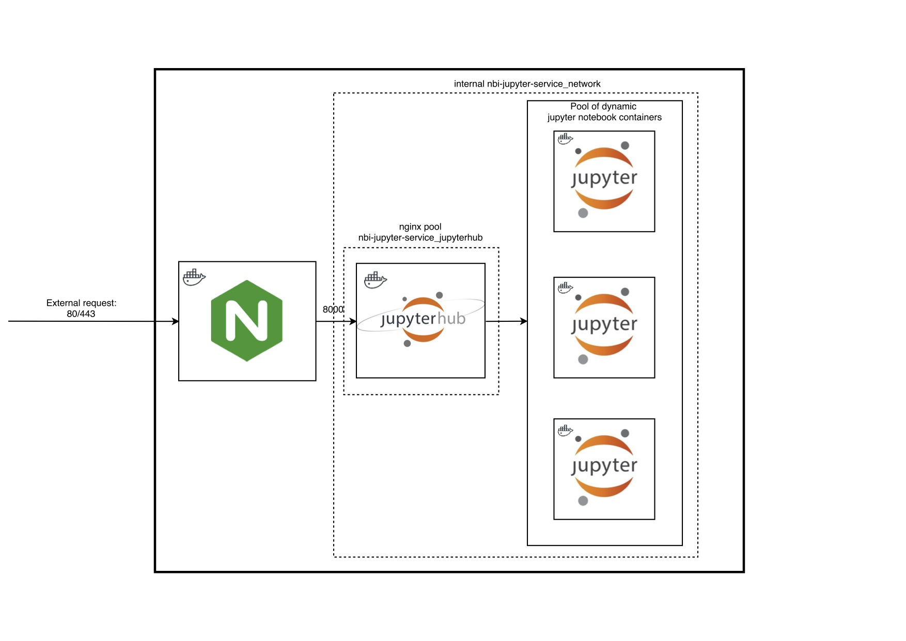

===================
nbi_jupyter_service
===================

A jupyter notebook docker swarm setup that consists of a standard proxy nginx
and a customised jupyterhub service that spawns individual notebooks for
individual users.

- `NBI Jupyterhub <https://github.com/rasmunk/docker-nbi-jupyterhub.git>`_

------------
Architecture
------------

An overview of how the different components of the
nbi_jupyter_service interconnects can be seen below:

The stack is made of a 3 layered docker service stack, i.e. any external
request is received by the Nginx front proxy service. This forwards any
request to the jupyterhub upstream nginx pool via the overlay virtual
``nbi-jupyter-service_default`` network.

Whether requests needs to be authenticated to launch notebooks via the
jupyterhub web interface, depends on which ``authenticator_class`` is defined in
the hub/jupyterhub_config.py configuration file.

The default ``spawner_class`` for the jupyterhub service is setup to launch
separate docker service notebooks when a user makes a 'spawn' request.

-------------
Prerequisites
-------------

Before the jupyterhub service is able to launch seperate notebook services,
jupyterhub needs access to the hosts docker daemon process. This access can
be gained in a number of ways, one of which is to mount the /var/run/docker
.sock file inside the jupyterhub service as a volume and then ensuring that
the user that executes the ``deploy`` command is part of the ``docker`` system
group. This is the default approach as set in the docker-compose.yml file.

Another approach would be to expose the docker daemon remotely on port 2376
with TLS verification as explained @ `Docker Docker <https://docs.docker
.com/engine/reference/commandline/dockerd/#description>`_ under "Daemon
socket option".

---------------------
Launching the Service
---------------------

To run this stack, simply execute the following command inside the repo
directory::

    docker stack deploy --compose-file docker-compose.yml nbi-jupyter-service

To verify that the stack is now deployed and the services are being spawned
do::

    docker stack ls
    docker services ls

The stack command should return that 2 services are running, in addition the
``services`` call should return that the jupyterhub and nginx service is
running/preparing to run. In addition it describes which ports the service
is accessible through the nginx front proxy via either port 80/443.
